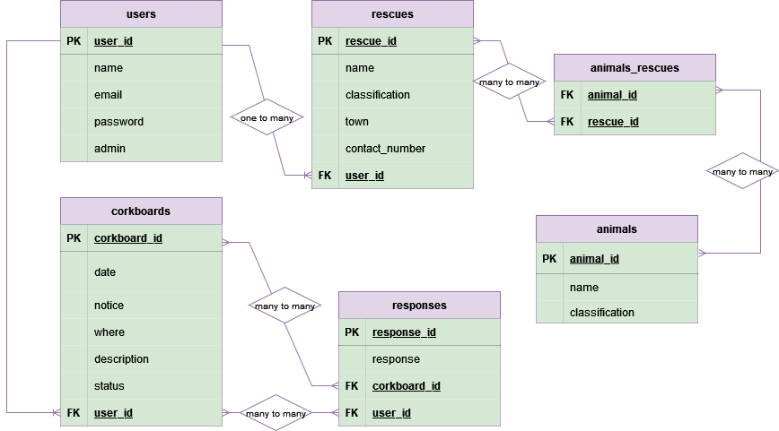

## JamesLister_T2A2 
# WILDLIFE RESCUE API (WRAPI)<br>
<br>

## <u> ABOUT WRAPPI;</U>
<br>

The Wildlife Rescue API or "WRAPI" is being developed to give those interested in wildlife conservation a platform to communicate with one another as well as for those interested in establishing their own rescue. For those establishing their own rescue, they will be able to add a rescue and determine the species specialisation of that rescue. This is turn will help to establish and build a data base where a user can ultimately find a suitable rescue depending on the animal in need based on location. Finally the added feature of the app will be a corkboard for notifications where users will have the ability to post notices in regards to volunteer activities such as supply runs, clean ups, working B's etc. The problem this app is trying to solve is that with societies growing conservational conscience more and more people would like to become involved in protecting and caring for our wildlife. Many of these rescue organisations are just 1 or 2 man operations so there is no reason more people can't become involved, and if not to go as far as setting up a rescue but to assist with volunteering their time to those who already have.(R1) 

This is a problem that needs solving because currently there is not central hub for this specific type of application. Sure there are more established conservationists organisations, but it's harder to locate the smaller mom and pop rescues short of trawling through the typical social media postings of gum tree and face book. Having a REST API with a growing data base of these rescues and those interested in volunteering will afford people the opportunity to help and give them insights into the accessibility of our native wildlife's welfare operations as opposed to it being too hard, too far or not the right species. (R2)  

Postgres, the database system that this Flask Restful API has been structured around was chosen in part due to it's excellent performance and scalability. It's excellent security features which include support for encryption, row-level security and access controls were also another key reason for choosing postgres to work alongside flask's built in support for authentication and authorisation. Flexibility is another important factor in determining the use of postgres and flask as the flexible nature of postgres, supporting a wide range of data types and advanced features make it a great database system to run side by side with flasks flexible micro web framework. Finally the primary use of SQL (structured query language) programming language for interacting with the database is a huge draw card as it is a powerful, widely adopted language that works hand in hand with flask-SQLalchemy. Utilising SQL also helps in maintaining security and data integrity by enforcing constraints such as primary and foreign keys. The main drawbacks of using this database system would be complexity of development as it's challenging to work with the tools as a new developer and might have taken longer in comparison to some more intuitive database systems. Another drawback could be performance as it may not be the best choice for heavy traffic without optimisation. Finally, the maintenance and cleansing of the data and the database can be more intensive than other systems especially as the application becomes more complex and customized. Overall however, used in conjunction with flask and associated 3rd party applications, postgres is an excellent choice in database system for this particular application. (R3)

Object-Relational Mapping, or ORM, is a programming approach that converts a relational database management system's 'tables into object-oriented programming structures. A high level of abstraction to a relational database is provided by an ORM tool, which enables developers to interface with databases using common object-oriented fundamentals such as classes, schemas, objects, and methods. To outline the key functionalities of the ORM approach is firstly, the object-oriented model and the database schema are mapped by the ORM. This is done by utilising the metadata that explains how objects are saved in the database. In comparison to SQL, ORM offers a higher level of abstraction. Using a different object-oriented syntax, developer can query with ORM and return the results as objects. Another key functionality is caching, ORM utilises frequently used data in memory to reduce the number of queries and finally transaction management which means database operations can be grouped into singular atomic transactions which either succeed or fail as a group in a unit. The main benefits of an ORM are developer productivity, portability, security and performance. The ORM approach reduces the amount of code a developer needs to write enhancing productivity. By eliminating the need to write code over and over when switching between database management systems the ORM model increases portability. Overall the ORM approach is an invaluable method to enlist when working with relational databases as it offers a higher-level abstraction over the database, which can increase performance, security, portability, and productivity. (R4)

## END POINTS;

### 1. **POST** REGISTER/CREATE USER - localhost:5000/auth/register<br>
```json
{"name": "Insert Name Here",
"email": "insertemail@email.com",
"password": "InsertPassword"}
```
**This registers/creates new user with bcrypt encrypted password hashing and JWT bearer token.*

### 2. **POST** LOGIN - localhost:5000/auth/login
```json
{"email": "existinguseremail@email.com",
"password": "ExistingPassword"}
```
**This returns bearer token for use on user specific functionality. Bearer token last 1 day before it expires.*

### 3. **GET** USERS - localhost:5000/users

**This returns all users in database and displays their associated rescues and their associated corkboard notices (if any).*

### 4. **POST** CREATE NEW RESCUE - localhost:5000/rescues
```json
{"name": "Insert Name of Rescue",
"classification": "Insert Classification",
"town": "Insert Town",
"contact_number": "1800 INSERT NUMBER"}
```
**This creates a rescue under the ID of the associated user (bearer access token required to determine user)*

### 5. **GET** RESCUES - localhost:5000/rescues

**This returns all rescues in database and lists all of the associated animals.*


### 6. **GET** RESCUE BY ID - localhost:5000/rescues/ID

**This return the specific rescue determined by ID and lists it's associated animals.*

### 7. **GET** SEARCH RESCUE BY TOWN OR CLASSIFICATION - localhost:5000/rescues/search?town=town or/ classification=classification

**This allows user to search for rescues by town or classification and is case insensitive.*

### 8. **PUT** UPDATE RESCUE BY ID - localhost:5000/rescues/ID
```json
{"name": "Update Name of Rescue",
"classification": "Update Classification",
"town": "Update Town",
"contact_number": "1800 UPDATE NUMBER"}
```
**This updates the specified rescue by ID (bearer access token of associated user required)*

### 9. **POST** ADD ANIMAL TO RESCUE BY ID - localhost:5000/rescues/ID/animals
```json
{"name": "Name of Animal",
"classification": "Classification"}
```
**This adds the species to the specified rescue by ID (bearer access token of associated user required) It also adds to an overall animals table which can have associations with other rescues.*

### 10. **DELETE** ANIMAL FROM RESCUE BY ID - localhost:5000/rescues/ID/animals
```json
{"name": "Name of Animal"}
```
**This deletes the species from the specified rescue by ID (bearer access token of associated user required) If the animal doesn't have associations with any other rescues it will be deleted from the database entirely. If it has associations with other rescues it will only be deleted from the associated rescue.*

### 11. **DELETE** RESCUE BY ID - localhost:5000/rescues/ID
**The associated user or the admin can delete the rescue by ID.*

### 12. **GET** ANIMALS - localhost:5000/animals
**This returns all animals in the database along with their classification and associated rescue information.*

### 13. **GET** ANIMALS BY ID - localhost:5000/animals/ID
**This returns the animal in the database corresponding to the animal ID*

### 14. **GET** SEARCH ANIMALS BY NAME OR CLASSIFICATION - localhost:5000/animals/search?name=name or/ classification=classification
**This allows user to search for animals by name or classification and is case insensitive. Returns the animal and classification along with any rescue details it's associated with.*

### 15. **GET** CORKBOARD NOTICES - localhost:5000/corkboards
**This returns all corkboard notices in the database along with associated user name and any responses.

### 16. **GET** CORKBOARD NOTICE BY ID - localhost:5000/corkboards/ID
**This returns the corkboard notice in the database corresponding to the ID*

### 17. **GET** SEARCH CORKBOARD NOTICES BY STATUS - localhost:5000/corkboard/search?status=status
**This allows user to search for corkboard notices by status and is case insensitive. Returns any notices with matching status along with user details and any responses.*

### 18. **POST** NEW CORKBOARD NOTICE - localhost:5000/corkboards
```json
{"notice": "Title of notice",
"where": "Location/ Rescue Organisation",
"description": "description of notice",
"status": "status"}
```
**This creates a corkboard notice under the ID of the associated user (bearer access token required to determine user). Automatically assigns the current date.*

### 19. **POST** RESPONSE TO CORKBOARD NOTICE BY ID - localhost:5000/ID/responses
```json
{"response": "Insert Response"}
```
**This allows users to respond to notices and responses will be attached to the notice determined by corkboard ID.*

### 20. **PUT** UPDATE CORKBOARD NOTICE BY ID - localhost:5000/corkboards/ID
```json
{"notice": "Update Title of notice",
"where": "Update Location/ Rescue Organisation",
"description": "Update description of notice",
"status": "Update status"}
```
**This updates the specified corkboard notice by ID (bearer access token of associated user required)*

### 21. **DELETE** CORKBOARD NOTICE BY ID - localhost:5000/corkboards/ID
**The associated user or the admin can delete the rescue by ID.*<br>
<br>

## <u>WRAPI ENTITY RELATIONSHIP DIAGRAM <br>
<br>



* R7 Detail any third party services that your app will use


* R8 Describe your projects models in terms of the relationships they have with each other


* R9 Discuss the database relations to be implemented in your application


* R10 Describe the way tasks are allocated and tracked in your project


Database Permissions -  Name = wrapi_db
                        Owner = wrapi_dev
                        Password = password123